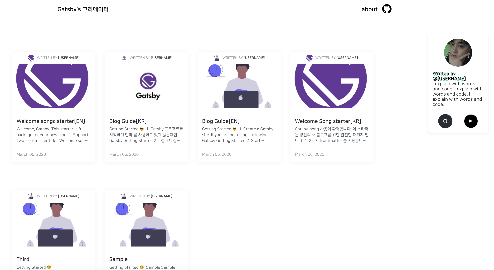
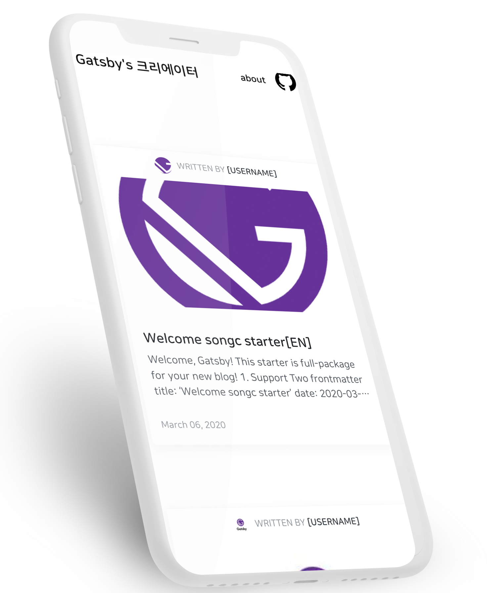

# gatsby-starter-song


## gatsby-template

In this template...

- 💄 Code highlight with NanumSquareRounds font
- 😄 Emoji (emojione)
- 💬 Comment feature (utterances)
- 🤖 GA
- ⭐ Enhance UX
- ⚙ Configurable





> [About this Template](https://www.gatsbyjs.org/starters/FFM-TEAM/gatsby-starter-song/)

## Demo

- [Default Theme](https://gatsby-starter-songc.netlify.com/)

<details>
  <summary>Use case</summary>
  <p>
    <ul>
      <li>DEMO: https://gatsby-starter-songc.netlify.com/</li>
    </ul>
  </p>
</details>

> If you're using this template, Please Pull Request for `Use case`!

## 😎 Quick Start

### 1. Create a Gatsby site

```sh
# create a new Gatsby site using the blog starter
$ npx gatsby new my-blog-starter https://github.com/FFM-team/gatsby-starter-song
```

> If you are not using `npx`, following [Gatsby Getting Started](https://www.gatsbyjs.org/docs/quick-start)

```sh
$ npm install -g gatsby-cli
$ gatsby new my-blog-starter https://github.com/FFM-team/gatsby-starter-song
```

### 2. Start developing

```sh
cd gat-starter/
npm start
# open localhost:8000
```

### 3. Add your content

You can write...

- contents to blog in `content/blog` directory.
- resume `content/__about` directory.

> With markdown syntax and some meta data

#### Support script for creating new post


```sh
npm run post
```


### 4. Fix meta data

You can fix meta data of blog in `/gatsby-meta-config.js` file.

### 5. Publish with [netlify](https://netlify.com)

[](https://app.netlify.com/start/deploy?repository=https://github.com/FFM-TEAM/gatsby-starter-song)

:bulb: if you want to deploy github pages, add following script to package.json

:bulb: if you want to deploy github pages, add following script to package.json

```json
"scripts": {
    "deploy": "gatsby build && gh-pages -d public -b master -r 'git@github.com:${your github id}/${github page name}.github.io.git'"
}
```

## 🧐 Customize

### ⚙ Gatsby config

```sh
/root
├── gatsby-browser.js // font, polyfill, onClientRender ...
├── gatsby-config.js // Gatsby config
├── gatsby-meta-config.js // Template meta config
└── gatsby-node.js // Gatsby Node config
```

### ⛑ Structure

```
src
├── components // Just component with styling
├── layout // home, post layout
├── lib
│    ├── remark
│    │      └── prismPlugin.js
│    ├── styles
│    │    ├── media         
│    │    ├── palette       
│    │    ├── responsive.ts  
│    │    ├── transitions.ts
│    │    ├── utils.ts
│    │    ├── zIndexes.ts
│    ├── heading.ts
│    └── utils.ts
├── pages // routing except post: /(home), /about
├── static
├── lib
│     └── blog-post.tsx
├── utils
├── lib
└── templates
└── typography.css

```

### 🎨 Style

You can customize color in `src/lib/styles` directory.

```sh
│    ├── styles
│    │    ├── media         
│    │    ├── palette       
│    │    ├── responsive.ts  
│    │    ├── transitions.ts
│    │    ├── utils.ts
│    │    ├── zIndexes.ts
│    ├── heading.ts
│    └── utils.ts
```

### 🍭 Tips (You can change...)

- Profile image! (replace file in `/content/assets/profile.jpg`)
- Favicon image! (replace file in `/content/assets/felog.png`)
- Header UserName 
- Utterances repository! (replace repository address in `/gatsby-meta-config.js`)
  - ⚠️ Please check, this guide(https://utteranc.es/)


## 🤔 currently  writing in the Medium ...

If you are currently writing in the Medium, consider migration with [medium-to-own-blog](https://github.com/mathieudutour/medium-to-own-blog)!

## :bug: Bug reporting Issue

[Issue](https://github.com/FFM-TEAM/gatsby-starter-song/issues)

## 🎁 Contributing

[Contributing guide](./CONTRIBUTING.md)


## LICENSE

[MIT](./LICENSE)

<div align="center">

<sub><sup>Project by <a href="https://github.com/s-ong-c">@songc</a></sup></sub><small>✌</small>

</div>