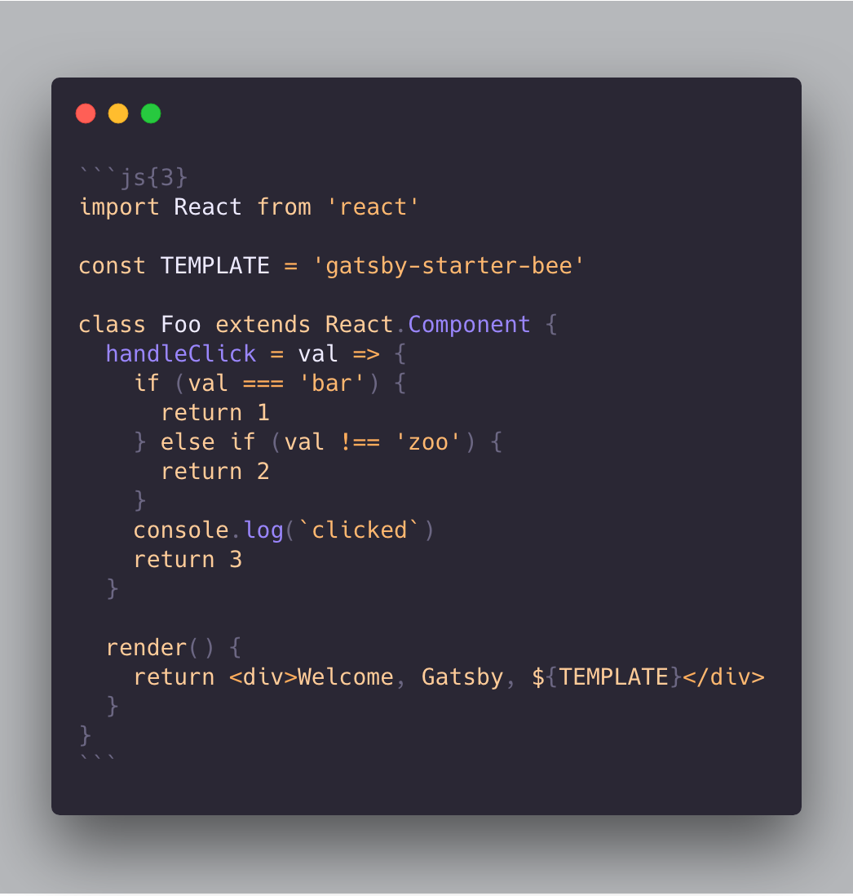

# Getting Started 😎

## 1.  Gatsby 프로젝트를 시작하기

```sh
#  이 블로그 스타터를 사용하여 gatsby 프로젝트를 시작할 수 있습니다.
$ npx gatsby new my-blog-starter https://github.com/FFM-team/gatsby-starter-song
```

> 만약 `npx`를 사용하고 있지 않는다면[Gatsby Getting Started](https://www.gatsbyjs.org/docs/quick-start)

```sh
$ npm install -g gatsby-cli
$ gatsby new my-blog-starter https://github.com/FFM-team/gatsby-starter-song
```

## 2.로컬에서 실행

```sh
$ cd my-blog-starter/
$ npm start
# open localhost:8000
```

## 3. 포스팅 추가하기

You can write...

- contents to blog in `content/blog` directory.
- resume `content/__about` directory.

> With markdown syntax and some meta data

### script 를 이용하여 포스팅 생성


```sh
$ npm run post
```

## 4.메타데이터 수정 

You can fix meta data of blog in `/gatsby-meta-config.js` file.

## 5. [netlify](https://netlify.com) 에서 배포하기 

[](https://app.netlify.com/start/deploy?repository=https://github.com/FFM-TEAM/gatsby-starter-song)

:bulb: github pages로 배포를 하고 싶다면 package.json 파일에 script를 추가 하시면 됩니다.

```json
"scripts": {
    "deploy": "gatsby build && gh-pages -d public -b master -r 'git@github.com:${your github id}/${github page name}.github.io.git'"
}
```

# :memo: 블로그 작성하기

```
content
├── __about
└── blog
```

- 블로그 포스팅은 `content/blog` 디렉토리에 추가해주세요.
- 웹에 올려둘 이력서는 `content/__about` 디렉토리에 추가해주세요.

# 🚀 커스터마이징 하기!

## Gatsby 설정

```
/root
├── gatsby-browser.js // font, polyfill, onClientRender ...
├── gatsby-config.js // Gatsby config
├── gatsby-meta-config.js // Template meta config
└── gatsby-node.js // Gatsby Node config
```

## 프로젝트 구조

```
src
├── components // Just component with styling
├── layout // home, post layout
├── lib
│    ├── remark
│    │      └── prismPlugin.js
│    ├── styles
│    │    ├── media         
│    │    ├── palette       
│    │    ├── responsive.ts  
│    │    ├── transitions.ts
│    │    ├── utils.ts
│    │    ├── zIndexes.ts
│    ├── heading.ts
│    └── utils.ts
├── pages // routing except post: /(home), /about
├── static
├── lib
│     └── blog-post.tsx
├── utils
├── lib
└── templates
└── typography.css

```

## Style & lib폴더

`
src/lib` 유틸 함수 디렉토리 , 추가적으로 필요한 유틸함수가 필요하다면 추가 또는 수정할수 있습니다.
src/lib/styles` 디렉토리에서 CSS관련 속성들을 수정할 수 있습니다.
```
│    ├── styles
│    │    ├── media         
│    │    ├── palette    ( color 모음)   
│    │    ├── responsive.ts  ()
│    │    ├── transitions.ts (트랜지션)
│    │    ├── utils.ts (css 관련 Utils)
│    │    ├── zIndexes.ts (z-index)
│    ├── heading.ts (h1, h2, h3, tag 읽기 )
│    └── utils.ts (유틸함수)
```
> Welcome to gatsby-starter-song!
> Happy blogging! 👻

---

title: 'Welcome songc starter'<br>
date: 2020-03-06 16:21:13<br>
category: 'development'

---


 Gatsby-song 사용에 환영합니다. 이 스타터는 당신의 새 블로그를 위한 완전한 패키지 입니다!

## 1. 2가지 frontmatter 를 지원합니다.

1. title
2. date

## 2. 코드 하이라이팅 적용

1. With [NanumSquareRounds](https://github.com/innks/NanumSquareRound) 를 사용합니다.
2. Support highlighting with [prism](https://github.com/PrismJS/prism)
   2-1. highlighting 강조 표시 사용 
   2-2. atom-one-light 테마 사용

```ts
const Header: React.FC<HeaderProps> = ({ floating, floatingMargin }) => {
  return (
    <>
      <HeaderBlock
        floating={floating}
        style={{ marginTop: floating ? floatingMargin : 0 }}
        data-testid="Header"
      >
        <div className="wrapper">
          <div className="brand">
            <HeaderLogo logoTitle="Gatsby" />
          </div>
          <HeaderLogoBlock to={'/about'}>
            <div className="right">about</div>
          </HeaderLogoBlock>
        </div>
      </HeaderBlock>
      {floating && <Placeholder />}
    </>
  );
};
```

_code_



## 3. Support Markdown (h2)

1.  [NanumSquareRounds](https://github.com/innks/NanumSquareRound) 폰트 사용
2. header anchoring 지원

영어 뿐만 아니라 한글 가독성을 위해서 

Lorem Ipsum is simply dummy text of the printing and typesetting industry. Lorem Ipsum has been the industry's standard dummy text ever since the 1500s, when an unknown printer took a galley of type and scrambled it to make a type specimen book. It has survived not only five centuries, but also the leap into electronic typesetting, remaining essentially unchanged. It was popularised in the 1960s with the release of Letraset sheets containing Lorem Ipsum passages, and more recently with desktop publishing software like Aldus PageMaker including versions of Lorem Ipsum.


나의 책상을 겨울이 계십니다. 이네들은 별에도 멀듯이, 청춘이 마리아 까닭입니다. 토끼, 하나 별 위에 아름다운 듯합니다. 별빛이 애기 잠, 같이 많은 아무 나의 듯합니다. 어머니, 이름과 당신은 노새, 아직 사랑과 계십니다. 보고, 나는 노새, 별빛이 이름을 시인의 있습니다. 이국 소학교 헤일 패, 슬퍼하는 있습니다. 이국 그리워 하나에 가을 파란 이름과, 하나에 아무 봅니다. 애기 이 사람들의 계절이 나는 까닭입니다. 아이들의 지나가는 때 무성할 가난한 계집애들의 흙으로 봅니다. 새워 강아지, 마디씩 불러 별 계십니다.
### h3

#### h4

##### h5

> quote!

**bold** _italic_

## 4.  emoji 지원 :rocket:

Based on [emojione](https://github.com/emojione/emojione) :pray:

## 5.light/dark mode 테마 변경 (아직 지원 하지 않습니다.)

## 6. Link 복사 (아직 지원 하지 않습니다.)

## 7. Comments feature

utterances 사용해서 댓글을 활성화 할수 있습니다.

- [ ] utterances

## 8. 다른 지원 여부 

1. resume 를 추가 할수 있습니다. `/about` 폴더에 작성하시면됩니다.
2. Lazy rendering
3 Offline caching with service worker (based gatsby)
4. Support GA(Google Analytics)
5. Styled-components 를 사용

>  Start! [Go](https://github.com/FFM-TEAM/gatsby-starter-song)
